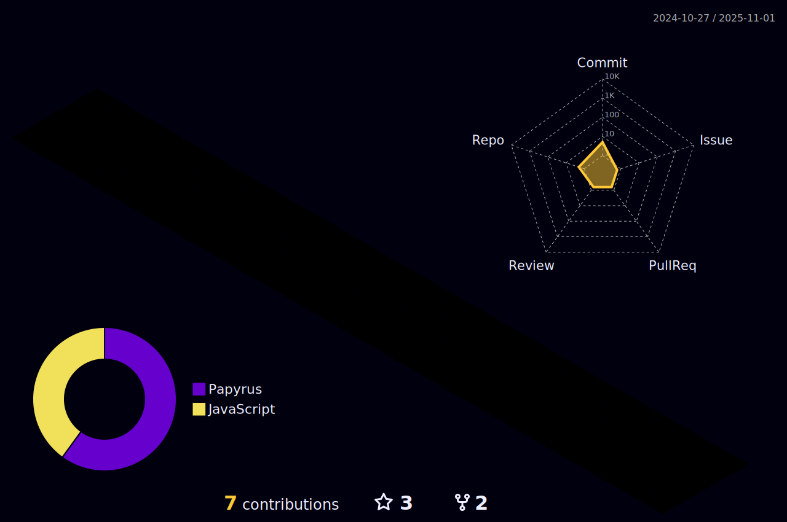

<!DOCTYPE html>
<html>
<head>
    <link rel="stylesheet" type="text/css" href="./assets/style.css">
</head>
<body>
<div align="center">


</div>
  <h1 align="center" style="font-size: 28px; letter-spacing: 0.1em;">Hola👋, Soy Julio Sevillano 💻</h1>

<h4 align="center" style="border: 2px dashed white;"><a href="https://git.io/typing-svg"></a></h4>
	
<div align="center">
	
</div>

<div>
	<a href="https://www.linkedin.com/in/julio-sevillano/" target="_blank"></a>
	<a href = "mailto:acirdeveloper@gmail.com"></a>
	<a href="https://twitter.com/acirdeveloper" target="_blank"></a>
  	<a href="https://www.instagram.com/acirdeveloper/" target="_blank"></a>
</div>

<div>
	
	
	
- 💻  Experiencia sólida en tecnologías como JavaScript, HTML y CSS, así como en frameworks como React. Capaz de crear sitios web dinámicos, responsivos y atractivos que brinden una experiencia óptima al usuario.
		
- 📱 Habilidades en el desarrollo de aplicaciones móviles, he explorado el mundo del desarrollo móvil con enfoque en la plataforma Android.
		
- 👨‍💻 Para conocer más sobre mis proyectos personales, te invito a visitar mi <br> <a href="#" target="_blank"></a>
</div>

<h2><b> ⚽ Mis habilidades clave son...<br></h2>

```js
const Julio = {
    pronouns: 'he' | 'him',
    code: [Javascript, Kotlin, Python, HTML, CSS],
    tools: [VSCode, Android Studio, Postman, Docker]
}
```

### Tech & Tools Preference

<p align="left">
	
	
	
	
	
		
	
	
	
	
		
	
 	
	
</p>

#

<details close="true">
<summary><b> ⚙️ &nbsp;GitHub Analytics 💯 </b></summary>

<br>



<p align="center">
<a href="https://github.com/AcirDeveloper">
  
  
</a>
</p>

<div style="display: inline_block"><br>
  
  
  
  
  
  
  
  	
</div>
</details>


</body>
